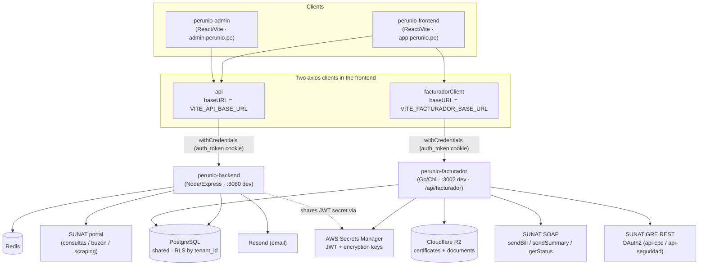
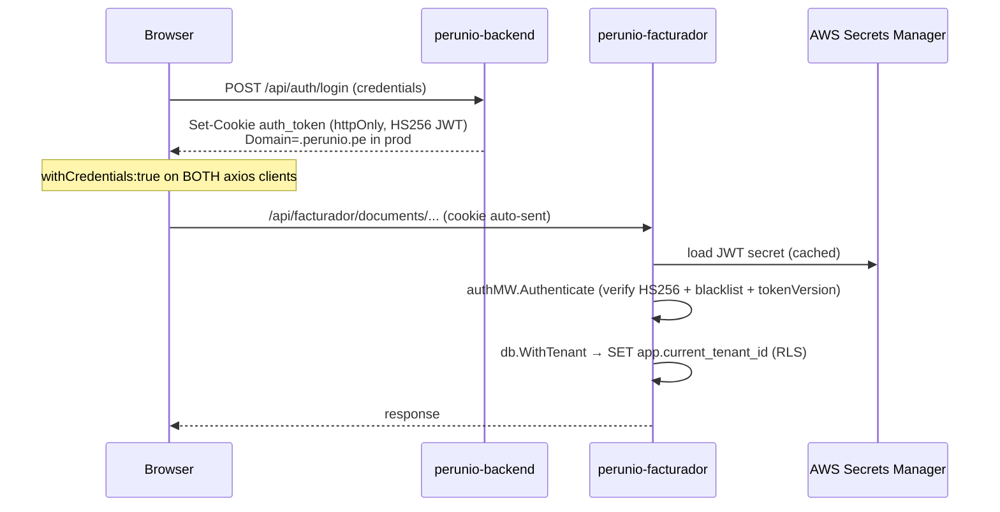
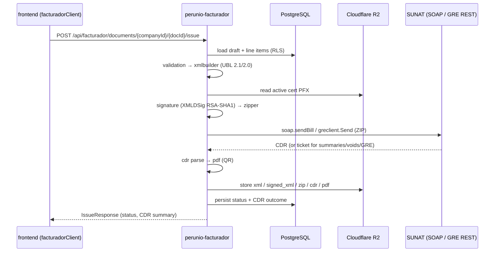

# Architecture — perunio-facturador in the Perunio platform

How the **frontend**, **backend**, and **facturador** services relate, and **which request talks to which service**. This reflects the current runtime wiring (verified against source). `perunio-facturador` (Go) is not absorbing all of `perunio-backend`'s (Node/Express) facturador features — it owns a specific slice, the **SUNAT emission/compliance pipeline**, and the backend keeps the surrounding CRUD and consultas. See "Where the boundary sits" below.

> TL;DR — The browser holds **two** API clients and calls **both** services directly. The split is **functional, not a land-grab**: `perunio-facturador` owns the **SUNAT emission/compliance pipeline** — the act of turning a draft into a signed, SUNAT-accepted document (build UBL → sign → ZIP → send → CDR/ticket) — and the entities you issue through it: **documents**, **series**, **voids** (comunicación de baja), **GRE emission** (guías), and **usage** metering. `perunio-backend` owns **everything else**: auth/billing, all supporting master-data CRUD (productos, clientes, categorías, plantillas, recurrentes, programados), certificate management, dashboards/comprobante listing, and SUNAT **consultas** (including GRE search/download). That backend ownership is by design — those are not "unmigrated" endpoints waiting to move. Both services share one PostgreSQL DB (RLS by tenant) and validate the same JWT cookie.

## Service map



Notes:
- **`perunio-admin` only talks to `perunio-backend`** — its `.env` has no `VITE_FACTURADOR_BASE_URL`.
- The two services **do not call each other over HTTP**. They integrate through the **shared PostgreSQL database** (and a shared JWT secret / encryption-key format). The Go service mirrors backend table shapes and the `crypto` AES-256-GCM format so both can read each other's rows.

## Which request goes where (current runtime)

The frontend's `src/lib/api.ts` defines two axios instances. The namespace decides the target service:

The rule of thumb: **if the request signs/sends something to SUNAT (or reads the state of something you issued), it goes to the Go service; otherwise it's backend CRUD.**

| Frontend API namespace | HTTP client | Target service | Path prefix |
|---|---|---|---|
| `documentsApi` (CRUD, `issue`, files, `usage`) | `facturadorClient` | **facturador (Go)** | `/documents/*`, `/usage` |
| `seriesApi` (CRUD) | `facturadorClient` | **facturador (Go)** | `/series/*` |
| `voidsApi` (comunicación de baja: CRUD, `issue`, `poll`) | `facturadorClient` | **facturador (Go)** | `/voids/*` |
| `despatchesApi` (GRE **emission**: CRUD, `issue`, `poll`, files) | `facturadorClient` | **facturador (Go)** | `/gre/*` |
| `authApi`, `companiesApi`, `invoicesApi`, `settingsApi`, … | `api` | backend | `/auth`, `/companies`, `/invoices`, … |
| `facturadorApi` (dashboard, comprobantes listing) | `api` | backend | `/facturador/dashboard`, `/facturador/comprobantes` |
| `productosApi` | `api` | backend | `/facturador/productos` |
| `clientesFacApi` | `api` | backend | `/facturador/clientes` |
| `categoriasProductoApi` | `api` | backend | `/facturador/categorias` |
| `plantillasApi` / `recurrentesApi` / `programadosApi` | `api` | backend | `/facturador/{plantillas,recurrentes,programados}` |
| `certificatesApi` | `api` | backend | `/companies/{companyId}/certificates` |
| `greApi` (GRE **consulta**: `search`, `download`) | `api` | backend | `/gre/search`, `/gre/download` |

Note the two GRE namespaces: **emission** (`despatchesApi`) is on the Go service, while **consulta/download** (`greApi`) is a read/scraping feature on the backend. Same SUNAT domain, opposite sides of the emission/read line — and they land on different services accordingly.

## Where the boundary sits (and why it's stable)

The division is by **responsibility**, not a migration counter ticking toward the Go service owning all "facturador" features:

- **`perunio-facturador` (Go)** owns the **emission/compliance pipeline** — validate → build UBL → sign (XMLDSig) → ZIP → send to SUNAT (SOAP / GRE REST) → parse CDR/ticket → PDF — and the entities you *issue*: documents, series, voids, GRE despatches, plus usage metering. This is what it does today from the frontend, and that's the intended scope.
- **`perunio-backend` (Node)** owns **everything around emission**: auth/billing, master-data CRUD (productos, clientes, categorías), templates/recurring/scheduled, certificate management, dashboards and comprobante listing, and SUNAT consultas. These stay in the backend by design — they are not endpoints "waiting to move."

Two deliberate placements worth calling out:

- **Certificate management stays in `perunio-backend`** (see the `server.go` comment). The Go signing pipeline reads the *active* certificate straight from the shared DB; it does not own the certificate CRUD API.
- **The Go service also implements `summaries/*`** (resumen diario `issue`/`poll`) under `/api/facturador`, consistent with the emission-pipeline scope, even though no frontend namespace currently calls it. Capability present ≠ boundary shifting.

**The table above is the live wiring; this section is the principle behind it.** Adding a new *emission* action means a new `facturadorClient` namespace; adding supporting CRUD means a backend one.

## Authentication



- Single cookie, single HS256 secret. The browser sends `auth_token` to **both** services because both clients set `withCredentials: true` and (in prod) the cookie is scoped to `Domain=.perunio.pe`.
- The Go service sources the same JWT secret (and encryption key) from **AWS Secrets Manager**, mirroring `perunio-backend`'s `aws-secrets.service.ts`. In dev it falls back to `JWT_SECRET` / `ENCRYPTION_KEY` env vars.
- Tenant isolation is enforced at the DB by **PostgreSQL RLS**; the Go service sets `app.current_tenant_id` inside `db.WithTenant`, identical to the backend.

## The facturador issue pipeline (Go service, end to end)



File artifacts (`xml | signed_xml | zip | cdr | pdf`) are returned to the browser as **presigned R2 URLs** via `GET /documents/{companyId}/{docId}/files/{fileType}`.

### The signer is a version-sensitive system binary

The `signature` step does not use a Go XMLDSig library — it shells out to the
**`xmlsec1` system binary** (OpenSSL backend). This is a real runtime dependency
of the facturador image, and its behavior changed across versions: **xmlsec
1.3.0 made key search strict**, so it tries to match the loaded key against the
(empty) `ds:KeyInfo/X509Data` in our signature template and refuses to fall back
to the single key we hand it, failing with `KEY-NOT-FOUND`. `internal/signature/signer.go`
detects the installed version and adds `--lax-key-search` (a 1.3.0+ flag) to
restore the pre-1.3 behavior.

Consequences for the architecture:

- The prod image (`Dockerfile`) **pins** `xmlsec=1.3.7-r0` on `alpine:3.21`. Bumping it requires re-verifying a real SUNAT signing.
- A developer's host `xmlsec1` usually differs (Ubuntu apt ships 1.2.x), so plain `make test` does **not** exercise the same key-search path prod runs.

## Testing the signing pipeline

Two layers, because the signer's behavior is version-dependent:

| Command | Runs on | Exercises |
|---|---|---|
| `make test` | your host `xmlsec1` (Ubuntu apt → 1.2.x) | fast inner loop; **not** prod's key-search path |
| `make test-prod` | prod runtime in Docker (`alpine:3.21` + `xmlsec=1.3.7-r0`) | the **exact** prod signer |

`make test-prod` builds `Dockerfile.test`, which compiles the signature test
binary with Go 1.26 and then runs it inside the pinned prod runtime. Compile and
run are deliberately separate stages: the Go toolchain only matters at build
time, the signer only at run time — so no single image needs both. The binary is
run **during the image build**, so a failing test aborts the build with a
non-zero exit; there are no volume mounts and your host `xmlsec1` is untouched.

Run `make test-prod` before shipping any change to `internal/signature`,
`internal/xmlbuilder` (the signature template), or the `xmlsec` pin in
`Dockerfile`. Keep the alpine tag and xmlsec pin in `Dockerfile.test` in sync
with `Dockerfile`.

## External dependencies by service

| Dependency | perunio-backend | perunio-facturador |
|---|---|---|
| PostgreSQL (shared, RLS) | ✅ | ✅ |
| `xmlsec1` system binary (XMLDSig signer, **version-pinned**) | — | ✅ |
| Redis | ✅ | — |
| Cloudflare R2 (certs + documents) | — | ✅ |
| AWS Secrets Manager | ✅ (JWT/keys) | ✅ (JWT/keys) |
| SUNAT SOAP (sendBill/sendSummary/getStatus) | — | ✅ |
| SUNAT GRE REST (OAuth2, `api-cpe.sunat.gob.pe`) | ✅ (**consulta** — `greApi` search/download) | ✅ (**emission** — `despatchesApi` issue/poll) |
| SUNAT portal scraping / consultas / buzón | ✅ | — |
| Resend (email) | ✅ | — |

## Configuration that controls the wiring

Frontend (`perunio-frontend/.env`):

```
VITE_API_BASE_URL=http://localhost:8080/api              # → perunio-backend
VITE_FACTURADOR_BASE_URL=http://localhost:3002/api/facturador  # → perunio-facturador (Go)
```

In production these resolve to `api.perunio.pe` and `facturador.perunio.pe`; the shared cookie works cross-subdomain via `Domain=.perunio.pe`. Backend CORS / facturador `AllowedOrigins` must list the app + admin origins for `withCredentials` requests to succeed.

---

_See `CLAUDE.md` for the Go service's internal package layout and the full endpoint list, and `SKILL.md` for the UBL/XML/SOAP/signing specification._
