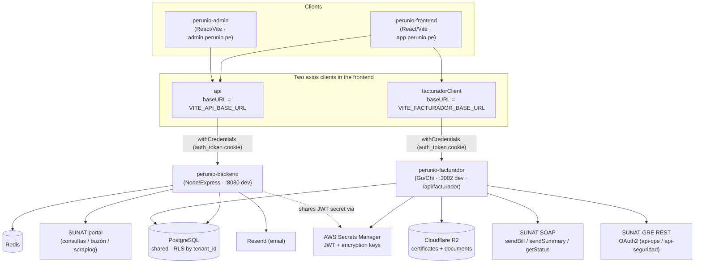
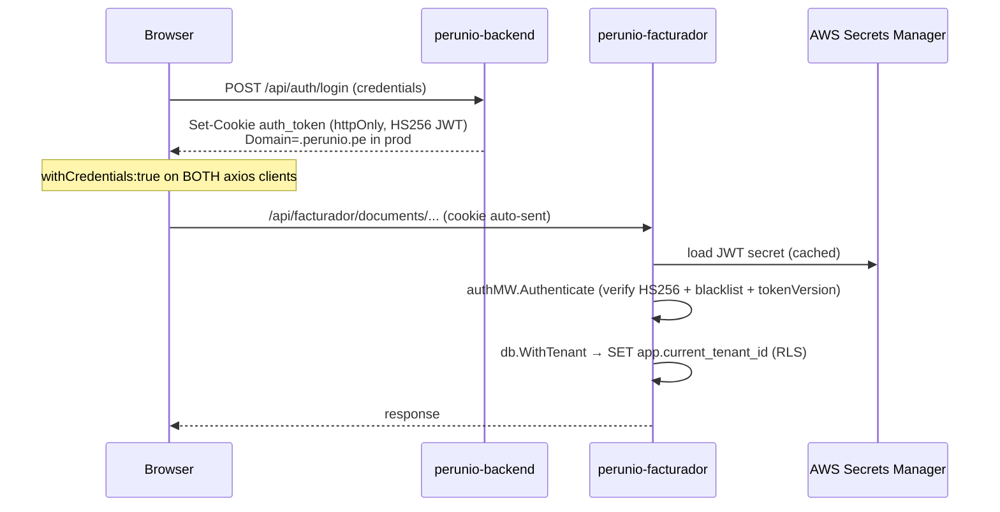
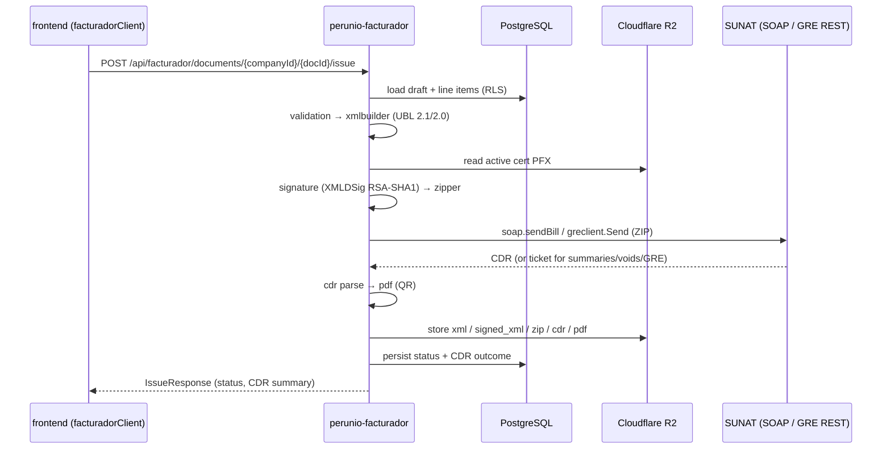

# Architecture — perunio-facturador in the Perunio platform

How the **frontend**, **backend**, and **facturador** services relate, and **which request talks to which service**. This reflects the current runtime wiring (verified against source), including the in-progress migration of facturador functionality from `perunio-backend` (Node/Express) into `perunio-facturador` (Go).

> TL;DR — The browser holds **two** API clients and calls **both** services directly. `perunio-backend` owns auth/billing/consultas plus the still-unmigrated facturador feature endpoints (productos, clientes, categorías, plantillas, recurrentes, programados, GRE, certificates, dashboard/comprobantes). `perunio-facturador` owns the SUNAT compliance pipeline it has taken over so far: **documents**, **series**, and **usage**. Both services share one PostgreSQL DB (RLS by tenant) and validate the same JWT cookie.

## Service map



Notes:
- **`perunio-admin` only talks to `perunio-backend`** — its `.env` has no `VITE_FACTURADOR_BASE_URL`.
- The two services **do not call each other over HTTP**. They integrate through the **shared PostgreSQL database** (and a shared JWT secret / encryption-key format). The Go service mirrors backend table shapes and the `crypto` AES-256-GCM format so both can read each other's rows.

## Which request goes where (current runtime)

The frontend's `src/lib/api.ts` defines two axios instances. The namespace decides the target service:

| Frontend API namespace | HTTP client | Target service | Path prefix |
|---|---|---|---|
| `documentsApi` (CRUD, `issue`, files, `usage`) | `facturadorClient` | **facturador (Go)** | `/documents/*`, `/usage` |
| `seriesApi` (CRUD) | `facturadorClient` | **facturador (Go)** | `/series/*` |
| `authApi`, `companiesApi`, `invoicesApi`, `settingsApi`, … | `api` | backend | `/auth`, `/companies`, `/invoices`, … |
| `facturadorApi` (dashboard, comprobantes) | `api` | backend | `/facturador/dashboard`, `/facturador/comprobantes` |
| `productosApi` | `api` | backend | `/facturador/productos` |
| `clientesFacApi` | `api` | backend | `/facturador/clientes` |
| `categoriasProductoApi` | `api` | backend | `/facturador/categorias` |
| `plantillasApi` / `recurrentesApi` / `programadosApi` | `api` | backend | `/facturador/{plantillas,recurrentes,programados}` |
| `certificatesApi` | `api` | backend | `/companies/{companyId}/certificates` |
| `greApi` | `api` | backend | `/gre/*` (backend proxies to SUNAT GRE REST directly) |

So: only **documents, series, and usage** currently flow to the Go service. Everything else labelled "facturador" in the UI is still served by `perunio-backend`.

## Migration status (backend → facturador)

The Go service **already implements** more than the frontend currently routes to it. `internal/http/server.go` registers, under `/api/facturador`:

- `usage` ✅ wired in frontend
- `series/*` ✅ wired in frontend
- `documents/*` (incl. `issue`, `files`) ✅ wired in frontend
- `summaries/*` (`issue`, `poll`) ⏳ implemented in Go, frontend not yet pointed here
- `voids/*` (`issue`, `poll`) ⏳ implemented in Go, frontend not yet pointed here
- `gre/*` (`issue`, `poll`, `files`) ⏳ implemented in Go, but frontend `greApi` still calls the **backend** `/gre/*`

Certificate management was intentionally **kept in `perunio-backend`** (see server.go comment); the Go signing pipeline reads the active certificate straight from the DB rather than owning the certificate CRUD API.

**Reading the table above tells you the live wiring; this list tells you where the boundary is heading.** When migrating an endpoint, the change is usually just repointing the frontend namespace from `api` to `facturadorClient`.

## Authentication



- Single cookie, single HS256 secret. The browser sends `auth_token` to **both** services because both clients set `withCredentials: true` and (in prod) the cookie is scoped to `Domain=.perunio.pe`.
- The Go service sources the same JWT secret (and encryption key) from **AWS Secrets Manager**, mirroring `perunio-backend`'s `aws-secrets.service.ts`. In dev it falls back to `JWT_SECRET` / `ENCRYPTION_KEY` env vars.
- Tenant isolation is enforced at the DB by **PostgreSQL RLS**; the Go service sets `app.current_tenant_id` inside `db.WithTenant`, identical to the backend.

## The facturador issue pipeline (Go service, end to end)



File artifacts (`xml | signed_xml | zip | cdr | pdf`) are returned to the browser as **presigned R2 URLs** via `GET /documents/{companyId}/{docId}/files/{fileType}`.

## External dependencies by service

| Dependency | perunio-backend | perunio-facturador |
|---|---|---|
| PostgreSQL (shared, RLS) | ✅ | ✅ |
| Redis | ✅ | — |
| Cloudflare R2 (certs + documents) | — | ✅ |
| AWS Secrets Manager | ✅ (JWT/keys) | ✅ (JWT/keys) |
| SUNAT SOAP (sendBill/sendSummary/getStatus) | — | ✅ |
| SUNAT GRE REST (OAuth2) | ✅ (current `/gre`) | ✅ (target `/api/facturador/gre`) |
| SUNAT portal scraping / consultas / buzón | ✅ | — |
| Resend (email) | ✅ | — |

## Configuration that controls the wiring

Frontend (`perunio-frontend/.env`):

```
VITE_API_BASE_URL=http://localhost:8080/api              # → perunio-backend
VITE_FACTURADOR_BASE_URL=http://localhost:3002/api/facturador  # → perunio-facturador (Go)
```

In production these resolve to `api.perunio.pe` and `facturador.perunio.pe`; the shared cookie works cross-subdomain via `Domain=.perunio.pe`. Backend CORS / facturador `AllowedOrigins` must list the app + admin origins for `withCredentials` requests to succeed.

---

_See `CLAUDE.md` for the Go service's internal package layout and the full endpoint list, and `SKILL.md` for the UBL/XML/SOAP/signing specification._
